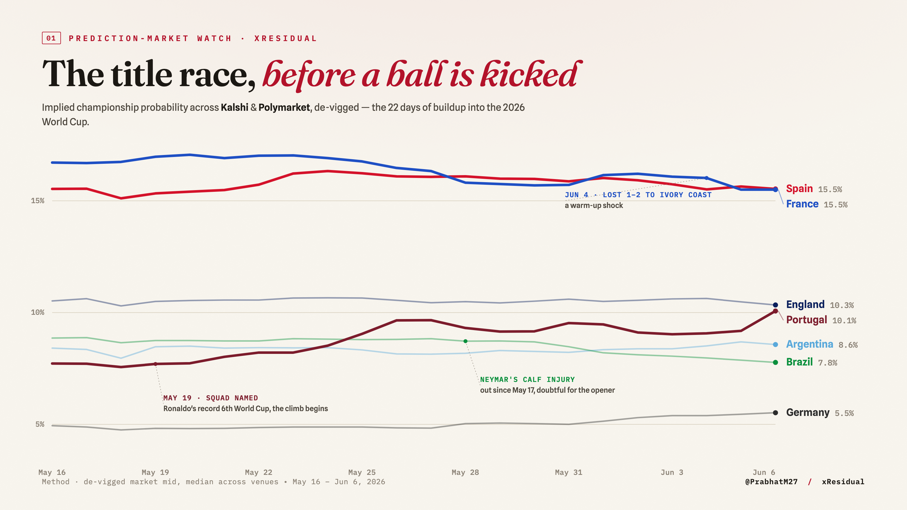

# xResidual

A live look at how prediction markets price the 2026 World Cup, and what they say about the tournament.

Markets like Kalshi and Polymarket turn thousands of opinions and a lot of real money into one number: the live probability of every World Cup outcome. xResidual tracks those numbers across all 104 matches (June 11 – July 19, 2026), next to the global bookmaker consensus, to see what the sharpest real-time forecasts on earth reveal about the tournament. The title race, the shocks, how fast belief moves, and how good these markets actually are.

A *residual* is what's left after you subtract expectation from reality: the surprise. The markets supply the expectation, the World Cup supplies the surprises, and this project is about both.



## What it does

Two kinds of question.

The first is what the markets say about the World Cup. Whose title odds are climbing and whose are collapsing, and the biggest single-day moves. The tournament's biggest shocks, and how fast the market absorbed them: when an 8% underdog wins, even an efficient market is surprised, and watching it reprice in real time is the interesting part (a ~3σ event, not the "12σ" stuff you'll see elsewhere). And where the prediction markets and the bookmakers see things differently, plus how tightly the two prediction markets agree with each other.

The second is how well the markets work. How calibrated are they on a chaotic, expanded 48-team field? Do real-money prediction markets aggregate information better than traditional bookmakers? How does price discovery unfold as news and kickoff approach? And how tightly do Kalshi and Polymarket converge once you strip the margins (so far, within about 0.1–0.2 percentage points on the title race)?

## Why this one exists

I'd already built [QuantF1](https://thesavagecoder7784.github.io/), a hierarchical Bayesian, risk-adjusted performance model for Formula 1. xResidual is its live, public counterpart: lighter, faster, and running in real time during the tournament instead of as a retrospective. The edge here is timeliness (this can only happen in June–July 2026) and prediction-market microstructure, comparing three venues as a global event unfolds.

It is not a betting model, and it is not an attempt to out-predict the markets. The premise is the opposite: these markets are very hard to beat, so instead of competing with them I treat them as the best lens on the tournament and ask how they work. Analysis travels because it's analysis; predictions only travel when they're right.

## Findings

Running notes, each framed by the decision it implies, live in [FINDINGS.md](FINDINGS.md). A few are already in before kickoff: Polymarket quotes about 27× Kalshi's depth at the same spread, every title favorite is sell-heavy, the favorite–longshot bias hides in the 1¢ tick, and the "altitude means more goals" idea doesn't survive a look at the data.

Tournament notes (updated weekly):

- Group-stage note — *pending June 2026*
- Knockout note — *pending July 2026*
- Retrospective, "The 2026 World Cup, in residuals" — *pending*

## Under the hood

Full spec is in [METHODOLOGY.md](METHODOLOGY.md). The short version:

- **Expectation baseline.** World Football Elo (computed from 49k open results) feeding a Skellam goal model, with home advantage calibrated to history (~0.47 goals, so `HOME_ADVANTAGE` ≈ 85). I tested the "altitude means more goals" prior on ~50k matches and dropped it, because the totals coefficient came back negative. This is a yardstick for measuring surprise, not a market-beater.
- **Independent tournament simulation.** A format-aware group→Final Monte Carlo (40k sims, 8 best thirds via FIFA Annex C, Dixon–Coles low-score correction), compared against the market. Pure Elo runs hotter on favourites than the market does; I traced that to Elo's blindness to squad value, and blending in Transfermarkt values (Peeters 2018) cut the gap vs Opta from ~4.7pp to ~0.7pp.
- **Residuals.** Per-match surprise as a log-score and a standardized z, with honest sigma discipline: real upsets are 1–3σ, and anything above 4σ means a broken model, not a miracle.
- **Sharpness and calibration.** CORP isotonic reliability diagrams with bootstrap consistency bands, an exact Brier decomposition, and three devig methods (multiplicative / power / Shin) so a finding doesn't hinge on the margin-removal choice.
- **Microstructure.** Order-book depth and spread, order-book imbalance (do the favorites sit bid or offered?), cross-venue convergence, lead–lag price discovery (does Kalshi or Polymarket move first?), and bookmaker dispersion. Early reads: Polymarket quotes ~27× Kalshi's depth at the same ~0.1¢ spread, and every title favorite is sell-heavy with OBI ≈ 0.2.
- **Trajectory.** Implied championship probability, and how fast belief moves, over the tournament.

Validated before kickoff: the calibration stack reproduces a clean reliability diagram on 3,850 historical international forecasts, and the live pipeline already prints the title race and market-vs-baseline gaps for upcoming fixtures.

## A note on honesty

A single tournament is ~104 matches, so probability claims at the extremes carry wide error bars, and the consistency bands show where a finding is real versus noise. Per-team "who's clutch" takes are flagged as small-sample color, not dressed up as inference. Where the markets are sharp, I say so; where reality surprised them, that's the tournament doing its job, not the market failing. A claim that can't be wrong isn't a finding.

## Repo layout

- `xresidual/` — the engine: Elo/Skellam baseline and residuals, `group_sim.py` / `knockout.py` (the format-aware tournament Monte Carlo), calibration (CORP), cross-venue microstructure, order-book imbalance, `ws_events` (ms lead–lag), trajectory, plots.
- `logger/` — append-only price logger across Kalshi / Polymarket / Odds API, plus `ws_capture.py` (real-time websocket capture for the lead–lag work). The live, time-gated capture; runs via `launchd`.
- `scripts/` — `run_analysis.py` (full report), `make_figures.py`, `build_all.py` (rebuild every card), and the per-card `build_*.py` (which write the simulation and market cards).
- `viz/` — editorial cards: `model/` (the simulation) and `market/` (market data). The analysis (`scripts/build_*.py`) and the rendered PNGs are public; the card HTML/CSS templates are kept private.
- `tests/` — 63 unit tests across the math core, calibration, microstructure, pipeline, plots, and lead–lag.

### Reproduce

```bash
pip install -r requirements.txt
python scripts/run_analysis.py        # live findings to date
python scripts/build_all.py           # regenerate every card's underlying data (_*.js)
```

Two layers, two reproducibility stories:

- **The model engine is fully reproducible from public sources.** `xresidual/data*.py` fetch results, fixtures, and historical forecasts (martj42, openfootball, 538) and cache them under `data/` on first run, so the simulation, calibration, and `viz/model/` cards regenerate from a clean clone with no inputs to supply.
- **The market layer streams from a live logger you run.** `logger/` records Kalshi / Polymarket / Odds API prices to `logger/data/` (git-ignored, since those feeds aren't mine to redistribute). The generated `viz/market/` data and PNGs are committed so the cards render as-is; regenerating them yourself means running the logger with your own API keys (`cp logger/config.example.json logger/config.json`).

## Follow along

Threads at [@PrabhatM27](https://twitter.com/PrabhatM27), part of my work at [thesavagecoder7784.github.io](https://thesavagecoder7784.github.io/).

## License

MIT.
