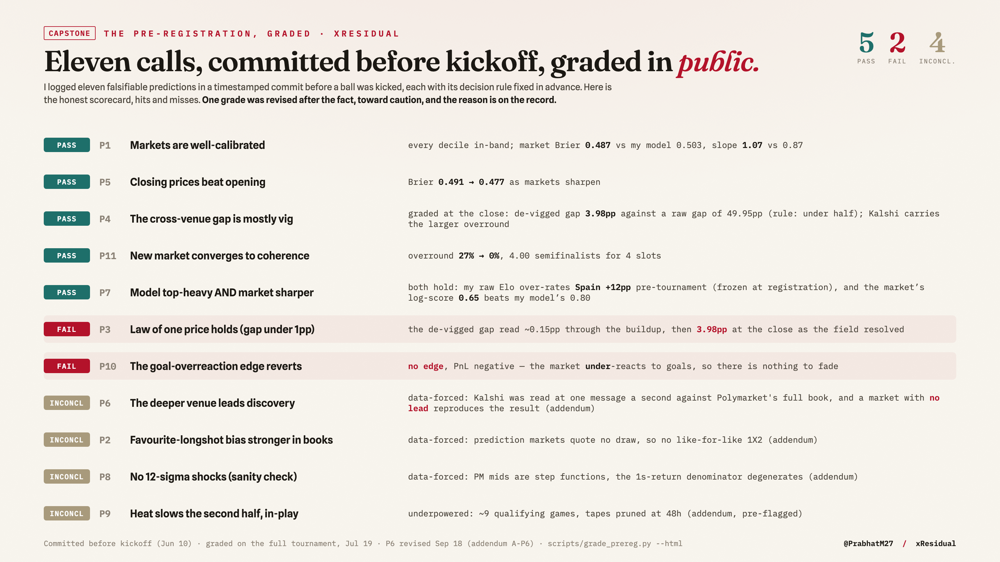

# xResidual

[](https://github.com/Thesavagecoder7784/xResidual/actions/workflows/ci.yml)

A forecasting model run live against the prediction markets through the 2026 World Cup, with its
predictions committed before kickoff and graded in public.

The markets — Kalshi, Polymarket and the bookmaker consensus — supply the expectation. The tournament
supplies the surprises. A *residual* is the gap between them, and this project is about both: how good
the markets' probabilities were, where an independent model disagreed with them, and who turned out
to be right.

> **Correction, 2026-09-18.** This project previously claimed that Polymarket prices World Cup goals
> about 600 ms before Kalshi. That finding is withdrawn: Kalshi's price was read at one message a
> second against Polymarket's full order book, and a market with no lead at all, measured the same
> way, reproduces it. What that changes, and what it doesn't, is in [CORRECTION.md](CORRECTION.md).



## What it found

**The market out-calibrated my model.** On the 72 group games my pre-registered model forecast before
kickoff, the de-vigged market scored a Brier of 0.487 against my model's 0.503, and its calibration
slope was 1.07 against 0.87 — my model's probabilities ran too extreme. The Brier gap alone is not
significant (paired p = 0.25), so the claim is "better calibrated", not "beat the model".

**My errors were draws, and the market had already priced them.** Seven of my eight worst calls were
draws, mostly a strong side failing to score against a deep block. On those calls the market had the
realised outcome 2.7 points higher than I did, and on realised draws generally it carried 25.8% against
my 21.1%. Where the model and a liquid price disagreed, the prior should have been that the model was
wrong — and it was ([retrospective](writeups/retrospective.md)).

**The 48-team format changed the game.** The group stage ran 2.99 goals per game *and* 27.8% draws,
high scoring and high drawing at once. The expansion didn't remove the jeopardy; it moved it to goal
difference: in simulation, the last third-placed team through and the first one out finish level on
points 72% of the time.

**The two venues agree on the event and differ on the price.** De-vigged, Kalshi and Polymarket sat
0.17 points apart on the title race on every day both books normalized. What separates them is cost:
overround ran 5.6% on Kalshi against 2.1% on Polymarket.

**The in-play market under-reacts to goals.** Immediately after a goal the price moves about 3 points
less than an independent in-play model says it should (54 matches, 185 goals), and on a curated subset
it books about a third of the fair move in log-odds. Measured on Polymarket alone, 30 seconds after
each goal. The subset is small (8 matches), so this is a lead, not a settled result.

**A visible dislocation is not a tradeable one.** When a goal lands, a follower chasing the move sees
a median 12.0¢ gap, comfortably positive after the spread on paper. But both venues' order books empty
at the goal and refill in 3–4 seconds, so once you gate on what is actually resting there, the median
match offers nothing to take. About 9% of goals were harvestable, clustered in a minority of matches
that could not be picked out in advance.

The full log — 40 findings including the nulls, one retraction and the withdrawn cross-venue results —
is [FINDINGS.md](FINDINGS.md).

## The model

An independent reference, not a market-beater. The point is to have something to measure the markets
against.

- **Ratings.** World Football Elo computed from about 49,000 international results, with home
  advantage calibrated to history (≈0.47 goals). The "altitude means more goals" prior was tested on
  ~50,000 matches and dropped when its coefficient came back negative.
- **Goals.** A Skellam model of goal difference, with a Dixon–Coles low-score correction so draws
  aren't under-produced.
- **Tournament.** A format-aware Monte Carlo from the group stage to the final (40,000 runs), with the
  eight best third-placed teams assigned to Round-of-32 slots by FIFA's Annex C constraints, solved as
  a bipartite matching so no group-stage rematch can occur in the Round of 32.
- **Two corrections, both found by arguing with the market.** Elo ignores squad quality, so it
  over-rated favourites; blending in Transfermarkt squad values cut the title-odds gap to Opta from
  ~4.7 to ~0.7 points. Elo also inflates weak, poorly connected confederations; an empirical-Bayes
  shrinkage fixes it and validates out of sample (+4.6% ranked-probability score, Diebold–Mariano
  p ≈ 0.009). After both, the model agrees with the de-vigged bookmaker consensus at 0.95 rank
  correlation.
- **Three versions, forward only.** v1 is frozen as registered. v2 recalibrates draws (calibration
  slope 0.87 → 0.98 at the same Brier). v3 adds a format-aware draw lift. Each fork applies only to
  forecasts made after it existed; no committed forecast was ever revised, so the versions can be
  scored honestly against each other. They cover different sets of matches, so their Brier scores are
  not a like-for-like race.
- **Dry-run first.** Before 2026, the pipeline ran end-to-end on every 2018 and 2022 match with a
  causal, point-in-time rating: well-calibrated, with real shocks at 2–3σ, not the "12σ" kind.

The full specification is [METHODOLOGY.md](METHODOLOGY.md).

## The pre-registration

Before kickoff I committed eleven falsifiable predictions to a tagged commit (`prereg-2026-06-10`),
each with its decision rule fixed in advance ([PREREGISTRATION.md](PREREGISTRATION.md)). They were
graded in public on July 19. The current grade is **5 pass, 2 fail, 4 inconclusive**.

One grade was revised afterwards, and only toward caution: P6, "the deeper venue leads price
discovery", moved from PASS to INCONCLUSIVE on 18 September when its measurement turned out to be
unable to see a lead. Every deviation, including that one, is dated and reasoned in
[PREREGISTRATION-ADDENDUM.md](PREREGISTRATION-ADDENDUM.md). The grade regenerates from committed
artifacts with `python scripts/grade_prereg.py`.

## The data

What's in this repository, and what you can do with it:

| Data | Where | Use it for |
|---|---|---|
| Forecast ledger — every pre-committed model forecast, timestamped against the market price at the time (7,342 rows) | [`paper/forecasts.jsonl`](paper/forecasts.jsonl) | Scoring the model against the market, closing-line value |
| Match forecasts, three model versions (72 / 71 / 55 matches) | [`paper/match_forecasts*.jsonl`](paper/) | Comparing v1, v2 and v3 on the group stage |
| Goal clock — every goal, card and shootout kick with minute stamps, reconciled 104/104 to the official scorelines | [`data/wc_goals_espn.json`](data/wc_goals_espn.json) | Anchoring any in-play analysis to real events |
| Aggregate market results — calibration, law of one price, under-reaction, harvestability, and the correction's placebo tests | [`writeups/_*.json`](writeups/) | Reproducing every number in the findings |
| Per-match aggregates (harvest, liquidity, order flow, information share) | [`viz/market/`](viz/market/) | Re-running the robustness scripts |
| Historical results, fixtures, 538 forecasts | Fetched from public sources on first run | Rebuilding the model from scratch |

**Not included:** the raw Kalshi and Polymarket order-book captures. Their terms restrict
republishing market data, and the tapes were pruned during the tournament. The capture code is here
(`logger/`), so anyone with venue credentials can record the same streams for a future event.

## Reproduce

```bash
pip install -r requirements.txt
make check                            # regenerate macros, run the 140-test suite
python scripts/grade_prereg.py        # the pre-registration scorecard, from committed artifacts
python scripts/run_analysis.py        # the model's report
python scripts/build_all.py           # rebuild every card's data
```

The model layer rebuilds from a clean clone with nothing to supply: results, fixtures and historical
forecasts are fetched from public sources (martj42, openfootball, 538) and cached under `data/`. Every
build stamps a content-hash provenance record (`viz/_provenance.js`) so a card can't silently drift
from the code and data that produced it. [REPRODUCING.md](REPRODUCING.md) maps each claim to the
script that produces it.

## Layout

- `xresidual/` — the model: Elo and Skellam baseline, the group-stage and knockout simulation,
  calibration (CORP reliability, Brier decomposition), de-vigging, residuals.
- `scripts/` — builders for every result and card, the pre-registration grader, and the correction's
  checks (`sampling_bias_check.py`, `matched_sampling_depth.py`, `lead_deconvolution.py`).
- `paper/` — the forward forecast ledgers and the paper-trading book.
- `logger/` — the price loggers and the in-play capture that ran 24/7 through the tournament.
- `deploy/` — how collection ran on an always-on Azure VM (decommissioned after the final).
- `docs/` — the [project site](https://thesavagecoder7784.github.io/xResidual/).
- `viz/` — the cards, and the per-match aggregates behind them.
- `writeups/` — the retrospective, the audit behind the correction, and supporting notes.
- `archive/` — superseded material kept for the record, including the withdrawn cross-venue work.
- `tests/` — the test suite.

## A note on honesty

A single tournament is about 104 matches, so claims at the extremes carry wide error bars, and
per-team "who's clutch" takes are colour, not inference. The log keeps its nulls and its retraction
in, and one headline result is withdrawn above, in full, with the test that overturned it. A claim
that can't be wrong isn't a finding, and a finding that turns out wrong should say so where people
will see it.

Threads at [@PrabhatM27](https://twitter.com/PrabhatM27); more work at
[thesavagecoder7784.github.io](https://thesavagecoder7784.github.io/). MIT licensed.
